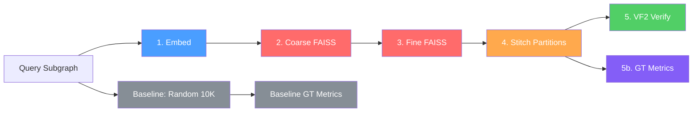

# Jigsaw Benchmark Metrics Reference

Complete reference for all 43 columns in `arxiv_eval.csv`.

## Pipeline Overview

---

## 1. Identifiers & Metadata

| Column | Type | Description |
|---|---|---|
| `query_id` | string | Unique ID, e.g. `k_hop_0_0` (type_partition_index) |
| `query_type` | string | Query category: `single`, `k_hop`, `sibling_walk`, `multi_coarse`, or `OVERALL` |
| `anchor_coarse` | float | The coarse partition the query was sampled from |
| `success` | bool | Whether the pipeline completed without errors |
| `query_nodes` | int | Number of nodes in the query subgraph |

### Query Types

| Type | What It Is | Partitions Spanned |
|---|---|---|
| `single` | Subgraph within one coarse partition | 1 coarse |
| `sibling_walk` | Spans multiple **fine** partitions within the **same** coarse partition (uses `generate_multi_fine_partition_query`) | 1 coarse, 2–4 fine |
| `multi_coarse` | Spans multiple **coarse** partitions via bridge edges | 2–5 coarse |
| `k_hop` | k-hop neighborhood from random anchor, naturally crosses many partitions | Many (10–20 coarse) |

---

## 2. Partition Prediction (Coarse-Level)

*"Did the model identify which partition(s) the query belongs to?"*

| Column | Type | Description |
|---|---|---|
| `predicted_coarse` | int | FAISS top-1 coarse partition prediction |
| `coarse_correct` | bool | Is top-1 prediction in the true partition set? **(= Coarse@1)** |
| `coarse_in_top_k` | bool | Is **any** true partition in the top-K (K=20) predictions? |
| `coarse_recall_at_k` | float [0,1] | Fraction of true partitions found in top-K |

### Fine-Level Prediction

| Column | Type | Description |
|---|---|---|
| `predicted_fine` | int | FAISS top-1 fine partition prediction |
| `fine_correct` | bool | Is top-1 fine prediction correct? |
| `fine_in_top_k` | bool | Is any true fine partition in top-K? |

---

## 3. Recall@K (Partition-Level)

*"How many of the true partitions appear in the top-K FAISS results?"*

| Column | Type | Description |
|---|---|---|
| `recall_at_1` | float [0,1] | Fraction of true partitions in FAISS top-1 |
| `recall_at_5` | float [0,1] | Fraction of true partitions in FAISS top-5 |
| `recall_at_20` | float [0,1] | Fraction of true partitions in FAISS top-20 |

**Example:** Query spans `{10, 20, 30, 40}`, FAISS top-5 = `{10, 15, 20, 25, 30}` → `recall_at_5` = 3/4 = 0.75

---

## 4. Stitching & Expansion

After FAISS prediction, partition nodes are stitched into a candidate subgraph via 3 expansion levels (top-1 → top-5 → top-20).

| Column | Type | Description |
|---|---|---|
| `stitched_nodes` | int | Total nodes in the final stitched graph (~21K on arxiv) |
| `stitched_partitions` | list | Coarse partition IDs included in stitching |
| `num_stitched` | int | Number of partitions stitched together |
| `vf2_level_reached` | string | Expansion level reached: `top-1`, `top-5`, or `top-20` |

---

## 5. Ground-Truth Partition Coverage

*"After stitching, do we cover the true partitions?"*

| Column | Type | Description |
|---|---|---|
| `gt_partitions_covered` | int | How many true partitions are in the stitched set |
| `gt_partitions_total` | int | Total true partitions for this query |
| `gt_partition_recall` | float [0,1] | **= covered / total** — key retrieval metric |
| `all_gt_partitions_found` | bool | Whether ALL true partitions are covered |

---

## 6. VF2 Subgraph Isomorphism

*"Is the query **exactly** present as a subgraph?"*

### Our Method (Stitched)

| Column | Type | Description |
|---|---|---|
| `vf2_stitched_found` | bool | Did VF2 find an exact match? |
| `vf2_stitched_solutions` | int | Number of isomorphic mappings found |
| `vf2_stitched_time` | float (s) | Time spent on VF2 |

### Baseline VF2

| Column | Type | Description |
|---|---|---|
| `vf2_baseline_found` | bool | Did VF2 find a match in random sample? |
| `vf2_baseline_time` | float (s) | Time for all baseline VF2 attempts |
| `vf2_baseline_attempts` | int | Retry attempts (up to 10) |
| `vf2_baseline_sample_size` | int | Nodes per attempt (default: 10,000) |

> [!NOTE]
> On ogbn-arxiv, VF2 achieves **0% success** for both methods — stitched graphs (~21K nodes) are too large for exact matching in the time limit.

---

## 7. Node-Level Quality ⭐

*"How well do the retrieved nodes overlap with the actual query nodes?"*

### Our Method (FAISS Retrieval)

| Column | Type | Formula | Description |
|---|---|---|---|
| `precision` | float [0,1] | `\|retrieved ∩ query\| / \|retrieved\|` | Fraction of retrieved nodes that are relevant |
| `recall` | float [0,1] | `\|retrieved ∩ query\| / \|query\|` | Fraction of query nodes that were retrieved |
| `f1` | float [0,1] | `2·P·R / (P+R)` | Harmonic mean |

### Why Precision is Low (~0.3%) — This is Expected

- Stitched graph: ~21,000 nodes (all nodes from ~20 partitions)
- Query: ~45–96 nodes
- Best possible precision: 96/21000 ≈ 0.46%
- **Recall is the meaningful metric here**

### Recall Interpretation

| Range | Meaning |
|---|---|
| 95–100% | Excellent — nearly all query nodes recovered |
| 80–95% | Good |
| 50–80% | Moderate — some partitions missed |
| <50% | Poor |

---

## 8. Baseline Ground-Truth Metrics

Random sampling baseline: pick random anchor → k-hop expand to ~10K nodes → compute overlap with query. Best result across 10 retries is kept.

| Column | Type | Description |
|---|---|---|
| `baseline_node_precision` | float [0,1] | `\|sampled ∩ query\| / \|sampled\|` |
| `baseline_node_recall` | float [0,1] | `\|sampled ∩ query\| / \|query\|` |
| `baseline_node_f1` | float [0,1] | Harmonic mean |
| `baseline_gt_partition_recall` | float [0,1] | Fraction of true partitions covered by sample |
| `baseline_all_gt_found` | bool | All true partitions covered? |
| `baseline_contains_query` | bool | Are **all** query nodes in the sample? |

> [!TIP]
> Baseline partition recall is high (~94%) because random 10K nodes span many partitions. But baseline **node recall is only ~25%** — it covers partitions without finding the query nodes. Jigsaw achieves **90.9% node recall** (3.6× better).

---

## 9. Timing

| Column | Type | Description | Typical |
|---|---|---|---|
| `embed_time` | float (s) | GNN encoder inference | ~7ms |
| `faiss_time` | float (s) | FAISS nearest-neighbor search | ~0.3ms |
| `vf2_time` | float (s) | Total VF2 time (dominates) | ~1.1s |
| `total_time` | float (s) | End-to-end pipeline | ~1.13s |

---

## 10. Quick Reference: Which Metric for What?

| Question | Look at |
|---|---|
| Can the model find the right partition? | `coarse_correct` (Coarse@1) |
| How many true partitions are retrieved? | `gt_partition_recall` |
| Are the actual query nodes recovered? | `recall` (Node Recall) |
| Is our method better than random? | `recall` vs `baseline_node_recall` |
| Is there an exact subgraph match? | `vf2_stitched_found` |
| How fast is the pipeline? | `total_time` |

## 11. Special Values

| Value | Where | Meaning |
|---|---|---|
| `NaN` | Various | Summary/overhead row (filter out `query_type == 'OVERALL'`) |
| `OVERALL` | `query_type` | Aggregated summary row, not a real query |
| `False` | `success` | Pipeline error — other metrics may be invalid |
